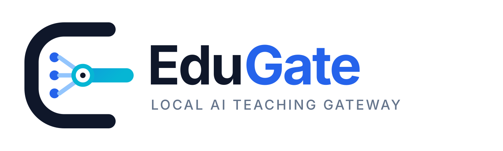
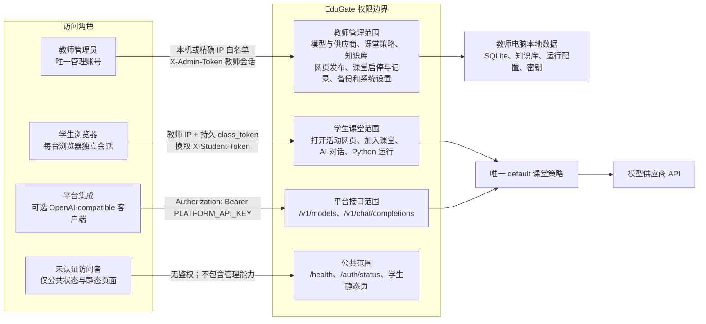

<p align="center">
  
</p>

# EduGate 单机课堂版

<p align="center">
  <strong>中文</strong> · <a href="README.en.md">English</a>
</p>

EduGate 在教师的 64 位 Windows 电脑上运行，面向单教师、单节课或小型课堂。教师用 Web 控制台配置模型、知识库和课堂策略；学生通过局域网课堂链接加入。管理数据、课堂记录和知识库保存在教师电脑中。

它也可以作为教室内的 AI 中转站：为后端应用提供 OpenAI-compatible API，为学习单和网页课件提供带学生会话隔离的流式接口。

## 现在的边界

- 只有一个教师管理员账号，不提供多教师账号和策略 API。
- 学生使用课堂令牌换取各自的学生会话，不接触教师令牌。
- 默认 `ALLOW_LAN_ADMIN=false`：教师管理页、登录和管理 API 只允许教师本机访问。平板管理需同时启用局域网管理并把设备 IP 加入 `ADMIN_ALLOWED_IPS`。
- 学生页面可在同一局域网访问；课堂令牌持久保存，开课、下课和程序重启都不改变链接。下课会撤销当前学生会话，主动换链才会淘汰旧链接。
- 源码要求 Python 3.10+；打包版自带运行环境，不要求教师电脑安装 Python。
- 下游后端使用独立平台密钥；浏览器网页只能用课堂令牌换取学生会话，不能接触平台密钥。
- 教师可在系统页上传 HTML/ZIP 并发布为正式学生入口；内置 IP 学习单仅为 Demo，课堂未开始时两类页面都不能使用课堂服务。

## 快速开始

### 打包版

1. 解压完整 `EduGate-Standalone` 文件夹，不要只复制 EXE。
2. 双击 `EduGate-Standalone.exe`，本机浏览器会打开教师控制台。
3. 在“系统”中添加模型供应商并导入模型。
4. 正式教学可在“系统 → 教学网页发布”上传 HTML/ZIP；不上传时入口使用内置 Demo 测试页。
5. 在“控制”中配置课堂并点击“开始课堂”，再复制链接或二维码发给学生；下课点击“结束课堂”。

便携版初始账号为 `admin`、密码为 `edugate`。本机默认自动进入，首次使用后仍建议修改密码。程序数据位于同目录的 `config` 和 `data`；迁移前先在“系统”页停止服务，再复制完整文件夹。

### 源码版

安装 64 位 Python 3.10 或更高版本，然后运行：

```text
desktop\install_backend_deps.bat
desktop\run_standalone.bat
```

## 学生如何分发

教师登录后即可复制固定课堂链接；点击“开始课堂”才会开放该入口。未发布自定义网页时使用内置 Demo 测试页：

```text
http://教师电脑局域网IP:端口/student.html#class_token=...
```

发布正式教学网页后，入口自动变为：

```text
http://教师电脑局域网IP:端口/published.html#class_token=...&page=...
```

链接由教师电脑局域网 IP 和持久课堂令牌共同定位一台 EduGate。只要没有主动点击“换一个链接”，同一链接可跨课次、跨班级和程序重启复用，适合提前嵌入课件。每次“开始课堂”仍会创建新的课堂记录批次；“结束课堂”会暂停入口并撤销当前学生会话，下次开课时原链接恢复可用。

点击“复制链接”，通过班级群、教学平台或投屏发给学生；也可以直接使用控制页生成的二维码。二维码同样包含课堂令牌，不应放到公开网站或公开群组。

学生无需填写姓名或电脑名。浏览器会生成稳定设备标识，服务据此创建设备标签和独立学生会话。详细流程见 [使用手册](docs/使用手册.md) 和 [架构与安全边界](docs/架构与安全边界.md)。

## 下游接口与网页嵌入

教师端“系统 → 下游接口与网页嵌入”提供可复制配置和代码：

- 后端程序：`GET /v1/models`、`POST /v1/chat/completions`，使用 `Authorization: Bearer <平台密钥>`；Base URL 为 `http://教师IP:端口/v1`，稳定模型名为 `edugate`。
- 教学网页：加载 `assets/edugate-client.js`，用持久 `class_token` 换取独立 `X-Student-Token`，再调用 `/chat/stream` 获取 SSE 流式回答。
- 托管教学网页：在系统页上传 HTML/ZIP，EduGate 通过隔离沙箱发布，并向网页提供 `EduGate.ask()` 流式桥接；控制页链接和二维码自动切换到活动网页。

`edugate` 会执行教师当前选择的上游模型、提示词和知识库，下游无需在教师调整策略后修改代码。平台密钥只能放在可信后端；网页源码中的课堂令牌只授予学生范围。外部网页跨域调用需要在高级设置填写准确的 `CORS_ORIGINS` 并重启服务。完整示例见 [下游接口与网页嵌入](docs/下游接口与网页嵌入.md)。

## 角色、权限与鉴权



| 角色 | 权限范围 | 鉴权方式 | 默认网络范围 |
| --- | --- | --- | --- |
| 教师管理员 | 模型供应商、课堂策略、知识库、教学网页发布、课堂启停、课堂记录、备份和系统设置 | 登录或本机自动登录后使用 `X-Admin-Token`；管理 API 同时校验来源 IP | 默认仅教师电脑；平板管理需设置 `ALLOW_LAN_ADMIN=true` 和精确 `ADMIN_ALLOWED_IPS` 白名单 |
| 学生 | 打开当前活动教学网页、加入当前课堂、AI 对话、受控 Python 运行 | 教师 IP 定位服务；活动网页和加入流程校验持久 `class_token`，再换取独立 `X-Student-Token` | 未开课、下课时页面/学生会话不可用；再次开课时原链接恢复；主动换链后旧链接永久失效 |
| 平台集成 | 查询虚拟模型并调用 `/v1/chat/completions`，执行当前教师策略 | `Authorization: Bearer PLATFORM_API_KEY` | 取决于服务监听地址；未配置平台密钥时接口关闭；密钥不得嵌入网页 |
| 未认证访问者 | 健康状态、初始化状态和允许公开的静态资源 | 无 | 教师管理页、API 文档和管理接口仍受来源与会话保护 |

IP 白名单是局域网准入控制，不是可替代密码的身份认证：设备 IP 可能因 DHCP 变化，也可能在不可信网络中被冒用。因此白名单设备仍需教师账号和 `X-Admin-Token`，建议给管理平板设置 DHCP 地址保留。

`class_token`、`X-Student-Token`、`X-Admin-Token` 和 `PLATFORM_API_KEY` 都属于 Bearer 凭证，应避免写入公开日志、截图或公开二维码服务。持久课堂令牌保存在 `data/secrets.json`，随完整备份和便携目录迁移。

## 代码结构

```text
EduGate-standalone/
├─ backend/
│  ├─ app/
│  │  ├─ main.py                # FastAPI 装配、中间件、路由注册和静态页面挂载
│  │  ├─ config.py              # 环境变量和 Python 运行配置
│  │  ├─ state.py               # 应用生命周期及共享服务实例
│  │  ├─ dependencies.py        # 教师、学生和平台接口鉴权依赖
│  │  ├─ schemas.py             # Pydantic 请求、响应和持久化模型
│  │  ├─ runtime_config.py      # 模型目录与唯一 default 课堂策略
│  │  ├─ chat_service.py        # 模型路由、知识检索、普通及流式对话
│  │  ├─ published_pages.py     # 教学网页校验、存储、活动入口和资源约束
│  │  ├─ api_docs.py            # OpenAPI 标签和接口说明
│  │  ├─ core.py                # 旧导入路径兼容门面；不承载新业务
│  │  ├─ routers/
│  │  │  ├─ auth.py             # 教师初始化、登录、退出和改密
│  │  │  ├─ classroom.py        # 课堂启停、学生加入和课堂记录
│  │  │  ├─ chat.py             # 学生对话及平台兼容接口
│  │  │  ├─ config.py           # 当前课堂模型和策略配置
│  │  │  ├─ knowledge.py        # 知识库来源、文件和索引管理
│  │  │  ├─ models.py           # 模型供应商、发现、导入和删除
│  │  │  ├─ python.py           # 受控 Python 普通及流式执行
│  │  │  ├─ publishing.py       # 教学网页上传、切换、删除和学生读取
│  │  │  └─ system.py           # 状态、日志、备份、恢复和服务控制
│  │  ├─ db.py                  # SQLite 管理状态、请求日志和课堂记录
│  │  ├─ knowledge.py           # 本地资料解析、切片和检索
│  │  ├─ python_runner.py       # 有界队列与隔离 Python 子进程
│  │  ├─ litellm_client.py      # OpenAI-compatible 上游 HTTP 客户端
│  │  ├─ security.py            # 会话、课堂令牌和限流基础设施
│  │  └─ system_ops.py          # 备份、恢复、目录与高级设置
│  ├─ tests/                    # 后端、权限、分发和回归测试
│  ├─ requirements.txt          # 运行依赖
│  └─ requirements-dev.txt      # 开发与测试依赖
├─ frontend/
│  ├─ admin.html                # 教师控制台
│  ├─ student.html              # 内置 Demo 测试页
│  ├─ published.html            # 教学网页安全包装页和流式桥接
│  ├─ assets/edugate-client.js  # 教学网页流式接入 SDK
│  └─ assets/brand/             # EduGate 图标和横向标识
├─ desktop/
│  ├─ edugate_standalone.py     # Windows 后台监督启动器
│  ├─ run_standalone.bat        # 源码日常启动
│  ├─ install_backend_deps.bat  # Python 3.10+ 依赖环境安装
│  └─ build_windows.bat         # Windows 便携目录打包
├─ docs/                        # 使用、安装、安全和开发文档
├─ samples/                     # 示例资料
└─ .github/workflows/           # Python 3.10 / 3.12 回归测试
```

`app/core.py` 只保留旧导入路径兼容；新增功能应放入对应服务或路由模块。

打包版首次运行后会在 EXE 旁创建 `config/` 和 `data/`。它们包含密码设置、数据库、知识库、教学网页、模型密钥和课堂记录，不属于源码目录，也不应提交到 GitHub。

## 开发验证

```powershell
python -m pytest -q -p no:cacheprovider -m "not e2e" --basetemp=.pytest-tmp --cov=backend/app --cov-branch --cov-report=term --cov-fail-under=85
python -m compileall -q backend\app
```

Windows 打包运行 `desktop\build_windows.bat`，输出位于 `dist\EduGate-Standalone`。

## 文档

- [使用手册](docs/使用手册.md)
- [安装与故障排查](docs/安装与故障排查.md)
- [架构与安全边界](docs/架构与安全边界.md)
- [下游接口与网页嵌入](docs/下游接口与网页嵌入.md)
- [教学网页发布](docs/教学网页发布.md)
- [开发与测试](docs/开发与测试.md)
- [测试覆盖与仿真审计](docs/测试覆盖与仿真审计.md)
- [文档索引](docs/README.md)

英文概览见 [README.en.md](README.en.md)。
