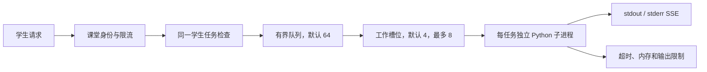

# Python 并发执行与课堂记录设计

**中文** · [English](Execution-and-Classroom-Records-Design.md) · [返回项目首页](../README.md)

本文档描述 EduGate 单机课堂版的 Python 执行任务池和教师课堂记录。两项能力共享课堂会话身份和课堂生命周期，但互不共享学生进程或可执行状态。

## 设计目标

- 64 名学生可以同时提交请求，代码任务在教师电脑允许的资源范围内并行运行。
- 任务数量超过执行槽位时有界排队，不能无限创建进程或无限占用内存。
- 学生能实时看到排队、开始运行、标准输出、错误输出和完成状态。
- 教师可以按课堂、学生电脑名/IP 和活动类型查看本机记录。
- 电脑名由学生首次进入时填写，IP 由教师端从请求获取；不让普通教师读取其他教师的课堂内容。
- 记录可关闭、自动过期并可按课堂永久删除。

## Python 任务池

任务池不是缓存。队列只保存尚未开始的任务描述，不复用结果，也不复用学生解释器。每个工作槽位取到任务后都会新建受限 Python 子进程，因此不同学生之间没有变量、模块或工作目录共享。

默认配置：

| 设置 | 默认值 | 边界 |
|---|---:|---:|
| `PYTHON_RUNNER_MAX_CONCURRENCY` | 4 | 1–8 |
| `PYTHON_RUNNER_MAX_QUEUE` | 64 | 1–256 |
| `PYTHON_RUNNER_QUEUE_TIMEOUT_SECONDS` | 30 | 1–300 秒 |
| `PYTHON_RUNNER_TIMEOUT_SECONDS` | 3 | 0.2–30 秒 |
| `PYTHON_RUNNER_MEMORY_MB` | 128 | 32–1024 MB/任务 |

同一学生会话同时只能有一个排队或运行任务。队列已满返回 HTTP 429，重复占位返回 HTTP 409，独立解释器不可用返回 HTTP 503。`/run_python` 保留完整 JSON 结果兼容旧客户端；`/run_python/stream` 使用 SSE 依次发送：

- `queued`：任务 ID、队列位置、槽位数。
- `running`：工作槽位和排队耗时。
- `stdout` / `stderr`：子进程实时输出。
- `done`：退出码、超时状态、总耗时和最终输出。
- `error`：队列过期、解释器不可用或服务器错误。

任务池提高吞吐量，但 Python AST 白名单和 Windows Job Object 仍不是强对抗安全沙箱。该能力只适合课堂短代码，不应作为公网在线判题平台。

## 课堂记录

课堂以“当前课堂链接周期 + 教师账号”为归档单位。服务启动或教师点击“换一个链接”会创建新的课堂周期；轮换时旧课堂立即结束，旧学生会话同时失效。

每条互动记录包含：

- 随机学生会话 ID，仅用于多轮会话、限流和内部关联。
- 学生填写的电脑名或座位号，以及教师端看到的请求 IP；教师页面显示为“电脑名 · IP”。
- 类型：`chat` 或 `python`。
- 学生最新问题或提交代码。
- AI 完整回答或 Python 输出。
- 时间、HTTP 状态、执行耗时、Python 排队耗时和超时状态。

不会保存课堂令牌、浏览器指纹或学生姓名。浏览器不能自动读取 Windows 电脑名，因此学生页面会要求首次填写，并在本地记住该值。兼容旧客户端直接使用课堂令牌时，服务以 `电脑-<IP>` 作为回退名称，同时继续使用每节课堂的私有随机 ID 维持内部会话。

## 权限与生命周期

- 普通教师只能列出、读取和删除自己账号下的课堂。
- 管理员可以查看和删除全部教师的本机课堂记录。
- `CLASSROOM_RECORDING_ENABLED=false` 会停止新增课堂内容，但不会自动删除已有记录。
- 默认保留 30 天、最多 20,000 条互动、单条输入和输出各最多 12,000 字符。
- 保留策略由数据库写线程定时执行，默认每 300 秒一次；启动时也会清理一次。
- 课堂记录位于 `edugate.sqlite3`，会进入完整备份；删除课堂记录会级联删除其互动内容。
- 技术请求日志和课堂内容记录相互独立。关闭 `LOG_MESSAGE_PREVIEW` 不会关闭课堂记录，反之亦然。

## SQLite 异步写入

技术请求日志和课堂互动先进入容量固定的内存队列，再由单独的 SQLite 写线程合并为批量事务。默认队列容量为 4,096 条、每批最多 100 条、最长等待 20 毫秒；这样并发请求无需逐条等待磁盘提交，也不会因日志积压无限占用内存。队列满时只丢弃新日志并累计告警计数，不阻塞课堂请求。

教师查看或删除记录、结束课堂、创建备份和关闭程序前都会插入写入屏障，等待此前的日志完成提交。系统状态接口会报告排队数、累计写入数、批次数、丢弃数、失败数以及上次清理时间。相关参数为 `DB_WRITE_QUEUE_SIZE`、`DB_WRITE_BATCH_SIZE`、`DB_WRITE_FLUSH_INTERVAL_MS` 和 `DB_CLEANUP_INTERVAL_SECONDS`，修改后需重启服务。

## 教师界面

“记录”标签提供四个层次：

1. 本机保存状态和保留期限提示。
2. 课堂数、学生电脑数、互动数和 Python 运行数摘要。
3. 按时间排列的课堂列表。
4. 当前课堂详情，可按学生电脑名/IP 和 `AI 对话 / Python` 筛选并删除整节课堂。

首版不要求学生账号或姓名、不提供长期学生画像，也不自动给学生评分。电脑名和 IP 只用于教师在当前课堂中定位设备；后续若增加导出或课堂分析，仍应保持课堂范围，不应把本地记录扩展成学校级学生档案。
