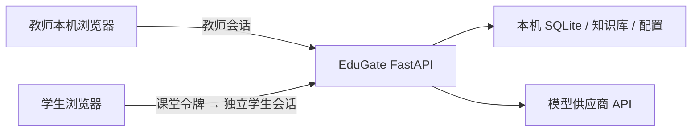

# 架构与安全边界

## 单教师架构

EduGate 单机课堂版只有一个教师管理员账号。教师在运行 EduGate 的电脑上配置模型、知识库和课堂策略；学生只通过课堂入口使用当前默认场景。项目不再提供教师账号列表、教师增删改或按教师分配模型/知识库的 API。

## 教师端访问权限

默认 `ALLOW_LAN_ADMIN=false`：

- `/`、`/admin.html`、`/docs`、`/redoc` 和 `/openapi.json` 只允许回环地址访问。
- `/auth/login` 只允许教师本机调用。
- 所有管理 API 既要求有效 `X-Admin-Token`，也要求请求来自教师本机。
- 首次初始化和便携版自动登录本来就只允许回环地址。
- 学生电脑可以访问 `/student.html` 和课堂接口，但拿不到教师会话。

如确实需要教师用局域网内另一台设备管理，可在“系统 → 高级设置”启用“允许从局域网访问教师管理端”，重启后生效。这会开放教师页面、登录和管理 API；局域网 HTTP 没有 TLS，请只在可信、隔离的教室网络中使用强密码，不建议在公共 Wi-Fi 或跨网段环境启用。

## 学生入口权限

课堂有三层状态：

1. 教师点击“开始课堂”后，服务生成不可预测的课堂令牌。
2. 学生用课堂令牌加入，服务签发绑定当前课堂的独立学生令牌。
3. AI 和 Python 接口验证学生令牌、课堂是否仍在进行，并执行每学生限流。

点击“换一个链接”或“结束课堂”会轮换/撤销课堂令牌，并清除现有学生会话。链接本身是临时凭证，仍应只发送给本班学生。

## 其他边界

- 管理密码使用 PBKDF2-SHA256 加盐哈希保存。
- 管理会话保存在进程内，默认 8 小时过期；服务重启后失效。
- 可选的 OpenAI-compatible 平台接口使用独立 `PLATFORM_API_KEY`，未配置时关闭。
- CORS 只控制浏览器跨域调用，不替代教师令牌或课堂令牌认证。
- 课堂记录和模型密钥都在教师电脑上；备份文件和便携目录应按敏感数据管理。
- Python 运行器降低了资源滥用风险，但不是用于运行不可信代码的强隔离沙箱。高风险环境应使用容器或独立执行主机。
