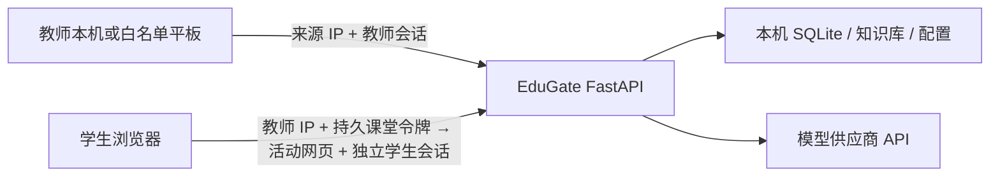

# 架构与安全边界

## 单教师架构

EduGate 单机课堂版只有一个教师管理员账号。教师在运行 EduGate 的电脑上配置模型、知识库和课堂策略；学生只通过课堂入口使用当前默认场景。项目不再提供教师账号列表、教师增删改或按教师分配模型/知识库的 API。

## 教师端访问权限

默认 `ALLOW_LAN_ADMIN=false`：

- `/`、`/admin.html`、`/docs`、`/redoc` 和 `/openapi.json` 只允许回环地址访问。
- `/auth/login` 只允许教师本机调用。
- 所有管理 API 既要求有效 `X-Admin-Token`，也要求请求来自教师本机。
- 首次初始化和便携版自动登录本来就只允许回环地址。
- 学生电脑可以加载公开包装页和 Demo 静态文件，但课堂未开始时无法读取活动发布文档、加入课堂或调用 AI，也拿不到教师会话。

如确实需要教师用局域网平板管理，必须在“系统 → 高级设置”同时配置：

- `ALLOW_LAN_ADMIN=true`；
- `ADMIN_ALLOWED_IPS=平板精确IP`，多个设备用英文逗号分隔。

EduGate 只接受白名单中的精确 IPv4/IPv6 地址，不信任浏览器传入的转发头。白名单设备仍需教师账号登录并在管理请求中携带 `X-Admin-Token`。IP 地址只能作为网络准入条件，不能单独证明操作者身份：DHCP 可能改变地址，不可信局域网也可能出现 IP 冒用。因此建议为管理平板设置 DHCP 地址保留，并只在可信、隔离的教室网络使用；局域网 HTTP 没有 TLS，不应暴露到公共 Wi-Fi、互联网或不受控跨网段环境。

## 学生入口权限

课堂入口有四层状态：

1. 首次启动时生成不可预测的课堂令牌，写入本地密钥存储并随备份迁移。教师电脑 IP 加上该令牌构成固定课堂链接。
2. 教师可选择 Demo 测试页或一个已上传网页作为活动入口。这个选择持久保存，与课堂令牌分离；换课件不需要换令牌。
3. 教师点击“开始课堂”只会建立新的课次 ID 并开放固定链接，不会改变令牌；发布文档读取和学生加入都要求课堂处于开放状态，学生加入后获得绑定该令牌的独立学生会话。
4. AI 和 Python 接口验证学生令牌、课堂是否仍开放，并执行每学生限流。

点击“结束课堂”会结束当前课次、暂停固定链接并清除现有学生会话；再次开始课堂时同一链接恢复可用，并以新课次 ID 分开记录。点击“换一个链接”才会轮换并持久化课堂令牌、永久淘汰旧链接，同时清除学生会话。这样，同一教师为多个班讲授相同内容或把 AI 入口嵌入课件时无需反复修改 URL。

不同教师各自在自己的电脑运行 EduGate，局域网 IP 不同；即使课堂令牌格式相同，`教师电脑 IP + 端口 + class_token` 也会定位到不同实例。课堂令牌仍属于 Bearer 凭证，应只发送给获准进入课堂的学生。

## 其他边界

- 管理密码使用 PBKDF2-SHA256 加盐哈希保存。
- 管理会话保存在进程内，默认 8 小时过期；服务重启后失效。
- 可选的 OpenAI-compatible 平台接口包含 `/v1/models` 和 `/v1/chat/completions`，使用独立 `PLATFORM_API_KEY`，未配置时关闭。该密钥只能用于可信后端，不能嵌入浏览器网页。
- 教学网页应使用公开的 `assets/edugate-client.js`，以持久课堂令牌换取独立学生会话后调用 `/chat/stream`；网页不会获得教师令牌或平台密钥。
- 系统托管的教学网页通过 `published.html` 包装页加载。上传的 HTML 运行在没有同源权限的 iframe 沙箱中；受信任包装页持有课堂令牌并提供 `EduGate.ask()` 消息桥接，上传网页本身不能读取教师存储或 Bearer 凭证。
- 上传 ZIP 只允许一个 `index.html` 和白名单静态资源；额外 HTML、SVG、可执行文件、符号链接与越界路径会被拒绝。活动 HTML 文档只有在课堂开放且令牌正确时返回。
- CORS 只控制浏览器跨域调用，不替代教师令牌或课堂令牌认证。
- 课堂记录、教学网页和模型密钥都在教师电脑上；完整备份会包含 `published_pages`，备份文件和便携目录应按敏感数据管理。
- 持久课堂令牌位于同一密钥存储中；泄露后应主动“换一个链接”，并更新已经嵌入课件或平台的 URL。
- Python 运行器降低了资源滥用风险，但不是用于运行不可信代码的强隔离沙箱。高风险环境应使用容器或独立执行主机。
